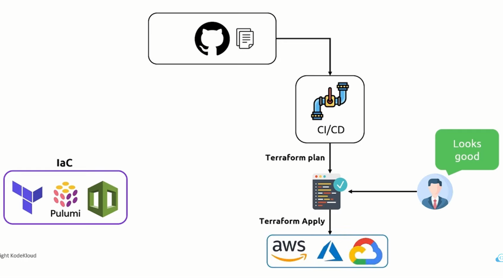
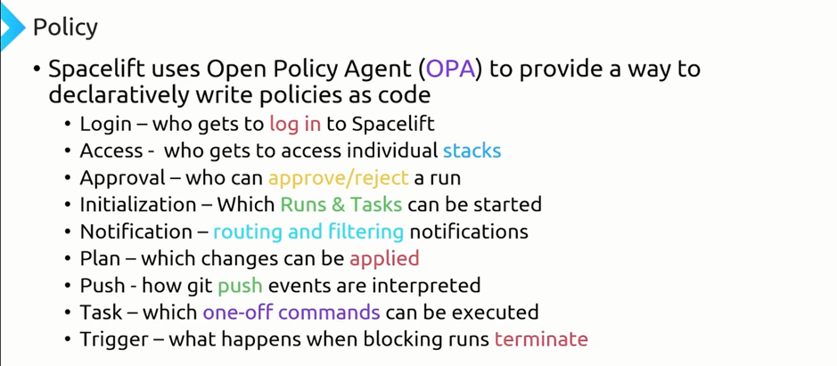
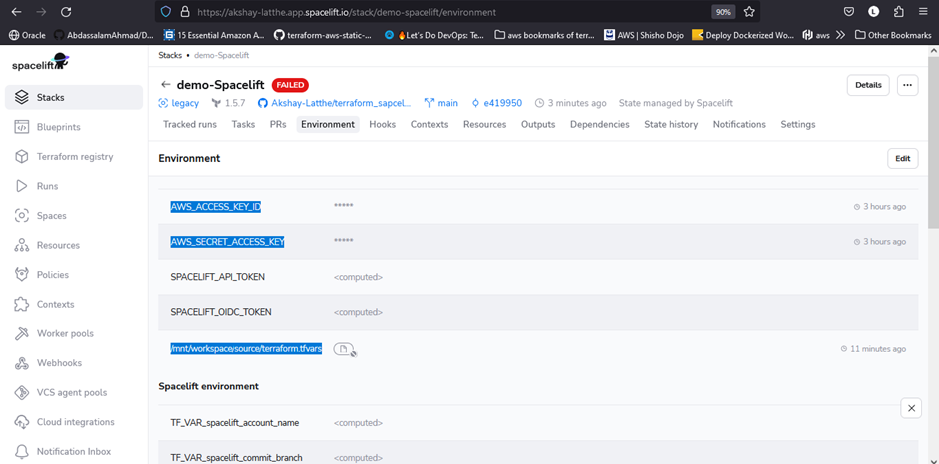
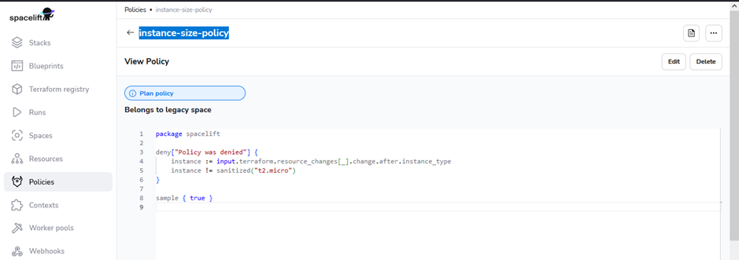
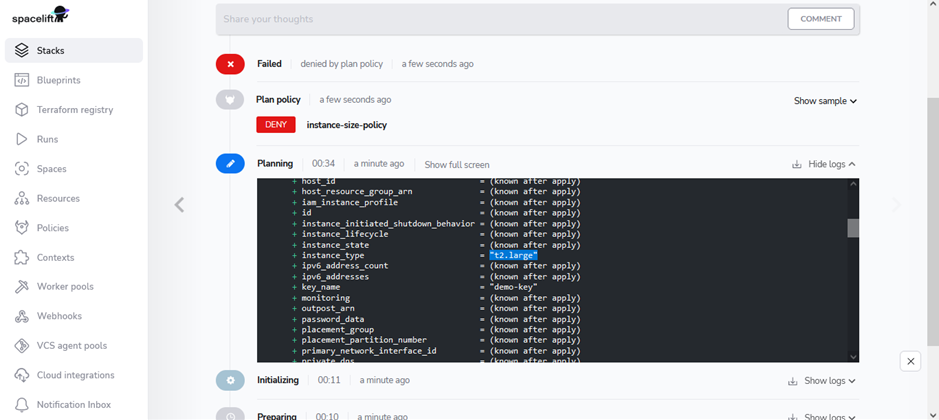

CICD for terraform with Sapcelift

Policies we can use as per below users 

Integrating Spacelift with GitHub for Terraform and AWS Deployments: A Step-by-Step Guide

Prerequisites:

A Spacelift account and administrator access.
A GitHub account and repository containing your Terraform configuration files.
An AWS account with IAM roles and policies configured for Terraform access.

Steps:

1)  Connect Spacelift to GitHub:
Marketplace Application:
            Visit the Spacelift Marketplace and install the "Spacelift" application.
            Select your GitHub organization or account and grant necessary permissions.
            Choose the repositories you want to integrate with Spacelift.
        Custom Application:
            Create a custom application in your GitHub account with the following permissions:
                repo:status
                workflows
                read:packages (if using GitHub Packages)
            Add the application's client ID and secret to Spacelift's configuration.

    Create a Spacelift Stack:
        In Spacelift, navigate to "Stacks" and click "Create Stack."
        Select "Terraform" as the Stack type.
        Specify the Stack name and optionally, a description.
        Choose the GitHub repository containing your Terraform code.
        Define the deployment branch (e.g., main).

    Configure Credentials and Variables:
        Credentials:
            Static Credentials: Never store credentials in code. Use environment variables, secrets managers, or Spacelift's credential store.
            IAM Roles: Create an IAM role in AWS with appropriate permissions and use AssumeRole credentials in your Terraform code.
            Spacelift Credential Store: For enhanced security, use Spacelift's credential store to manage credentials securely.
        Variables:
            Use Terraform variables to define sensitive information like passwords, API keys, etc.
            Store variables securely in Spacelift's variable store, environment variables, or secrets managers.

    Create Policies (Optional):
        Use Open Policy Agent (OPA) policies to define rules for Terraform deployments.
        Policies can enforce compliance, restrict resources, or perform other actions based on specific conditions.

    Define Workflows:
        Create workflows in Spacelift to automate Terraform deployments.
        Workflows can be triggered manually, automatically on pull requests or merges, or based on other events.
        Define the workflow steps, including Terraform commands, approval gates, and notifications.

Additional Considerations:

    Best Practices:
        Follow security best practices for credential management and variable handling.
        Use OPA policies to enforce compliance and security rules.
        Implement CI/CD pipelines for automated deployments and testing.
    Troubleshooting:
        Refer to Spacelift's documentation for troubleshooting steps.
        Check Spacelift logs and GitHub Actions logs for detailed information.

Example Commands:

Spacelift:

spacelift stack create my-stack --type terraform --repo-url https://github.com/my-org/my-repository

I'd be glad to provide a comprehensive response to the prompt, incorporating the best aspects of Response A and Response B, addressing their shortcomings, and leveraging insights from the ratings:

Integrating Spacelift with GitHub for Terraform and AWS Deployments: A Step-by-Step Guide

Prerequisites:

    A Spacelift account and administrator access.
    A GitHub account and repository containing your Terraform configuration files.
    An AWS account with IAM roles and policies configured for Terraform access.

Steps:

1) Connect Spacelift to GitHub:
        Marketplace Application:
            Visit the Spacelift Marketplace and install the "Spacelift" application.
            Select your GitHub organization or account and grant necessary permissions.
            Choose the repositories you want to integrate with Spacelift.
        Custom Application:
            Create a custom application in your GitHub account with the following permissions:
                repo:status
                workflows
                read:packages (if using GitHub Packages)
            Add the application's client ID and secret to Spacelift's configuration.

2)  Create a Spacelift Stack:
        In Spacelift, navigate to "Stacks" and click "Create Stack."
        Select "Terraform" as the Stack type.
        Specify the Stack name and optionally, a description.
        Choose the GitHub repository containing your Terraform code.
        Define the deployment branch (e.g., main).

3)  Configure Credentials and Variables:
        Credentials:
            Static Credentials: Never store credentials in code. Use environment variables, secrets managers, or Spacelift's credential store.
            IAM Roles: Create an IAM role in AWS with appropriate permissions and use AssumeRole credentials in your Terraform code.
            Spacelift Credential Store: For enhanced security, use Spacelift's credential store to manage credentials securely.
        Variables:
            Use Terraform variables to define sensitive information like passwords, API keys, etc.
            Store variables securely in Spacelift's variable store, environment variables, or secrets managers.

4)   Create Policies (Optional):
        Use Open Policy Agent (OPA) policies to define rules for Terraform deployments.
        Policies can enforce compliance, restrict resources, or perform other actions based on specific conditions.

5)   Define Workflows:
            Create workflows in Spacelift to automate Terraform deployments.
            Workflows can be triggered manually, automatically on pull requests or merges, or based on other events.
            Define the workflow steps, including Terraform commands, approval gates, and notifications.

Additional Considerations:

    Best Practices:
        Follow security best practices for credential management and variable handling.
        Use OPA policies to enforce compliance and security rules.
        Implement CI/CD pipelines for automated deployments and testing.
    Troubleshooting:
        Refer to Spacelift's documentation for troubleshooting steps.
        Check Spacelift logs and GitHub Actions logs for detailed information.

Example Commands:

Spacelift:
Bash

spacelift stack create my-stack --type terraform --repo-url https://github.com/my-org/my-repository

Use code with caution. Learn more

Terraform:
Bash

terraform init
terraform plan
terraform apply

OPA Policy:
package my_policy

default allow = false

allow {
  input.operation == "apply" and
  input.plan.all_changes.resource_type != "aws_iam_user"
}

By following these steps and considering the best practices, you can securely and efficiently integrate Spacelift with GitHub to automate Terraform deployments for your AWS infrastructure.

referrances 
https://www.youtube.com/watch?v=gfxw_zPpO-4
https://docs.spacelift.io/

I. Prerequisites:

    Spacelift account (administrator access)
    GitHub account (repository containing Terraform files)
    AWS account (IAM roles and policies configured for Terraform)

II. Integration Steps:

    Connect Spacelift to GitHub:
        Marketplace Application:
            In the Spacelift Marketplace, install the "Spacelift" application.
            Select your GitHub organization/account and grant permissions.
            Choose desired repositories to integrate.
        Custom Application:
            Create a GitHub application with permissions:
                repo:status
                workflows
                read:packages (if using GitHub Packages)
            Add application's client ID and secret to Spacelift config.

    Create a Spacelift Stack:
        Navigate to "Stacks" in Spacelift and click "Create Stack."
        Select "Terraform" as the Stack type.
        Specify Stack name and optional description.
        Choose the GitHub repository containing your Terraform code.
        Define the deployment branch (e.g., main).

    Configure Credentials and Variables:
        Credentials:
            Never store credentials in code! Use environment variables, secrets managers, or Spacelift's credential store.
            IAM Roles: Create an IAM role in AWS with appropriate permissions and use AssumeRole credentials in your Terraform code.
            Spacelift Credential Store: For enhanced security, use this to manage credentials securely.
        Variables:
            Use Terraform variables for sensitive information (passwords, API keys, etc.).
            Store variables securely in Spacelift's variable store, environment variables, or secrets managers.

    Create Policies (Optional):
        Use Open Policy Agent (OPA) policies to define rules for Terraform deployments.
        Policies can enforce compliance, restrict resources, or perform other actions based on specific conditions.

    Define Workflows:
        Create workflows in Spacelift to automate Terraform deployments.
        Workflows can be triggered manually, automatically on pull requests/merges, or based on other events.
        Define workflow steps, including Terraform commands, approval gates, and notifications.

III. Additional Considerations:

    Best Practices:
        Follow security best practices for credential and variable management.
        Use OPA policies for compliance and security.
        Implement CI/CD pipelines for automated deployments and testing.
    Troubleshooting:
        Refer to Spacelift's documentation for troubleshooting steps.
        Check Spacelift and GitHub Actions logs for detailed information.

IV. Example Commands:

Spacelift:
Bash

spacelift stack create my-stack --type terraform --repo-url https://github.com/my-org/my-repository

Use code with caution. Learn more

Terraform:
Bash

terraform init
terraform plan
terraform apply

Use code with caution. Learn more

OPA Policy:
Code snippet

package my_policy

default allow = false

allow {
  input.operation == "apply" and
  input.plan.all_changes.resource_type != "aws_iam_user"
}

Use code with caution. Learn more

V. Customization:

    Replace placeholders like my-stack and https://github.com/my-org/my-repository with your specific values.
    Add details about any additional configurations or policies specific to your project.
    Adapt the README's content and structure to meet your team's preferred documentation style.

By following these guidelines and customizing the template, you can create a comprehensive and informative README file to facilitate efficient and secure Spacelift integration for your Terraform and AWS deployments.